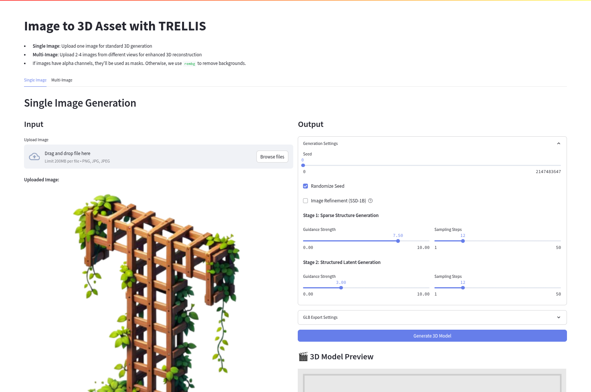

<p align="center">

</p>

<p align="center">
<a href="https://github.com/microsoft/TRELLIS"></a>
<a href="https://hub.docker.com/r/cassidybridges/trellis-box"></a>
<a href="https://pytorch.org"></a>
<a href="#requirements"></a>
<a href="https://github.com/off-by-some/TRELLIS-BOX/blob/main/LICENSE"></a>
</p>

This repository hosts a containerized implementation of Microsoft's [TRELLIS](https://github.com/microsoft/TRELLIS) image-to-3D generation pipeline. Here we've optimized it with FP16 mixed precision support for efficient GPU usage and automatic GLB export capabilities. It enables users to generate high-quality 3D models from single images or multi-view inputs through a simple web interface, reducing VRAM requirements by ~50% while maintaining generation quality.


## Quickstart

To get up and running, you can build the repository to build from source:
```bash
$ git clone https://github.com/off-by-some/TRELLIS-BOX && cd TRELLIS-BOX
$ ./trellis.sh run
``` 

Or if you prefer, pull and run the pre-built Docker image:
```bash
$ docker run --gpus all -it -p 8501:8501 \
              -v ~/.cache/trellis-box:/root/.cache \ 
              -v ~/.cache/rembg:/root/.u2net \
              -v $(pwd)/outputs:/tmp/Trellis-demo \
            cassidybridges/trellis-box:latest
```
Then simply open http://localhost:8501 in your browser to access the web interface. See the [Docker Configuration Guide](docs/DOCKER_CONFIGURATION.md) for more detailed instructions & configurations. 

## Use Cases

<p align="center">

</p>

### Single Image to 3D Model
Transform a single 2D image into a detailed 3D model. Perfect for product visualization, character design, or architectural concepts. The pipeline automatically removes backgrounds and generates textured meshes ready for 3D printing or game engines.

### Multi-View Enhancement
Upload 2-4 images from different angles to improve generation quality and reduce artifacts. Ideal for complex objects where a single viewpoint isn't sufficient, such as detailed mechanical parts or intricate sculptures.

### Batch Processing Workflows
Integrate into automated pipelines for content creation studios. Generate multiple 3D assets from image collections with consistent quality and automatic GLB export for seamless import into downstream tools.

### Research and Prototyping
Rapidly prototype 3D concepts from sketches or reference images. The FP16 optimizations make it accessible for researchers working with limited GPU resources, enabling faster iteration cycles.

## Installation Details

### Prerequisites
- **Docker**: Install Docker Engine with NVIDIA Container Toolkit support
- **GPU**: NVIDIA GPU with at least 8GB VRAM (recommended: 16GB+)
- **Platform**: Linux, macOS, or Windows with Docker Desktop
- **Storage**: ~20GB free space for models and Docker layers
- **Nvidia GPU**: Pull requests welcome for additional GPU support!

### Docker Setup
1. **Install NVIDIA Container Toolkit** (Linux):
   ```bash
   # Ubuntu/Debian
   distribution=$(. /etc/os-release;echo $ID$VERSION_ID)
   curl -s -L https://nvidia.github.io/nvidia-docker/gpgkey | sudo apt-key add -
   curl -s -L https://nvidia.github.io/nvidia-docker/$distribution/nvidia-docker.list | sudo tee /etc/apt/sources.list.d/nvidia-docker.list
   sudo apt-get update && sudo apt-get install -y nvidia-docker2
   sudo systemctl restart docker
   ```

2. **Verify GPU access**:
   ```bash
   # Quick test
   docker run --rm --gpus all nvidia/cuda:12.3.2-cudnn9-runtime-ubuntu22.04 nvidia-smi
   ```

### Custom Build (Optional)
For development or custom modifications, build from source:
```bash
./scripts/build.sh  # Build the Docker image
./scripts/run.sh    # Start the container
```

### Remote GPU Setup
If running on a remote GPU machine (like via SSH), ensure proper GPU access:

1. **SSH into your GPU machine:**
   ```bash
   ssh user@your-gpu-server-ip
   ```

2. **Verify GPU access:**
   ```bash
   ./scripts/check_gpu.sh
   ```

3. **Run TRELLIS:**
   ```bash
   ./scripts/run.sh
   ```

4. **Access the web interface:**
   - Local: http://localhost:8501
   - Remote: http://your-gpu-server-ip:8501 (ensure firewall allows port 8501)

### Publishing to Docker Hub
To share your image on Docker Hub:
```bash
# Publish with version tag
./scripts/publish.sh v1.0.0

# Or publish as latest
./scripts/publish.sh latest
```
The script will prompt for your Docker Hub username and handle login if needed.

## How to Contribute

### Development Setup
1. Fork and clone the repository
2. Ensure Docker and NVIDIA Container Toolkit are installed
3. Build the development image:
   ```bash
   ./trellis.sh build
   ```
4. Start the container in development mode:
   ```bash
   ./trellis.sh run
   ```

### Testing Changes
- Modify `app.py` or other source files
- Restart the container: `./trellis.sh restart`
- Test the web interface at http://localhost:8501
- Check Docker logs: `docker logs trellis-box`

### Pull Request Process
1. Create a feature branch from `main`
2. Make your changes with clear commit messages
3. Test thoroughly with different GPU configurations
4. Submit a pull request with a detailed description
5. Address any review feedback

### Reporting Issues
- Use the [issue tracker](https://github.com/off-by-some/TRELLIS-BOX/issues) for bugs and feature requests
- Include your GPU model, Docker version, and error logs
- For performance issues, include `nvidia-smi` output

## Usage

### Single Image Generation
Upload one image to generate a 3D model. Background removal is applied automatically with quality preservation.

### Multi-View Generation
Upload 2-4 images from different angles. The pipeline cycles through images during sampling for improved conditioning.

## Configuration

### Configuration
The Docker image is fully configurable via build arguments and environment variables. See the [Docker Configuration Guide](docs/DOCKER_CONFIGURATION.md) for more detailed instructions & configurations.


### Environment Variables
```bash
# Memory optimization
PYTORCH_CUDA_ALLOC_CONF=max_split_size_mb:256

# FP16 precision
TORCH_USE_CUDA_DSA=1
```

### Generation Parameters
Adjust in `app.py`:
- `DEFAULT_SS_STEPS`: Sparse structure sampling steps (default: 12)
- `DEFAULT_SLAT_STEPS`: Structured latent sampling steps (default: 12)
- `DEFAULT_SS_GUIDANCE`: Sparse structure guidance strength (default: 7.5)
- `DEFAULT_SLAT_GUIDANCE`: SLAT guidance strength (default: 3.0)

## Troubleshooting

### Memory Issues
- Check GPU memory: `nvidia-smi`
- Clear cache: `docker exec trellis-box python -c "import torch; torch.cuda.empty_cache()"`
- Reduce batch size for multi-view inputs

### Build Issues
- Clean rebuild: `./trellis.sh stop && docker system prune -f && ./trellis.sh build`
- Check Docker logs: `docker logs trellis-box`

### Model Issues
- Clear cache: `docker exec trellis-box rm -rf /app/.cache/torch/hub/checkpoints/`
- Restart: `./trellis.sh restart`

## Architecture

### Pipeline Stages
1. **Image Preprocessing**: Background removal, cropping, resizing
2. **Sparse Structure Generation**: Flow-based latent generation
3. **Structured Latent Generation**: Feature refinement
4. **Mesh/Gaussian/Radiance Field Decoding**: 3D representation generation
5. **GLB Export**: Automatic texture baking and export

### Memory Optimizations
- FP16 conversion for transformer models
- FP32 preservation for normalization layers
- Aggressive CUDA cache clearing
- Memory defragmentation techniques

### Multi-View Implementation
- Cycles through conditioning tensors during sampling
- Maintains proper tensor shapes and dtypes
- Compatible with CFG and guidance interval sampling

## Background

This Docker implementation was created to make Microsoft's TRELLIS 3D generation pipeline more accessible to users who prefer containerized deployments. The original TRELLIS research introduced significant advancements in 3D generation quality and versatility, but required complex environment setup and substantial computational resources.

The key motivations for this Docker implementation include:

- **Simplified Deployment**: Traditional TRELLIS setup requires installing numerous dependencies across different platforms, which can be error-prone. Docker containers provide a consistent, reproducible environment.

- **Resource Optimization**: The original implementation could require significant VRAM. FP16 mixed precision optimizations reduce memory requirements by ~50% while maintaining generation quality.

- **Production Readiness**: Containerization enables easier integration into existing workflows, automated deployment pipelines, and scaling across different hardware configurations.

- **Developer Experience**: The web interface and automatic GLB export make the technology more accessible to non-experts while maintaining the full power of the underlying TRELLIS models.

## Acknowledgements

I encountered a lot of issues running TRELLIS for myself, until i found [UNES97's trellis-3d-docker project](https://github.com/UNES97/trellis-3d-docker), which provided the initial Dockerized implementation. Special thanks to [@UNES97](https://github.com/UNES97) for the containerization of TRELLIS, making it accessible for anybody within the community. 

This project builds upon Microsoft's [TRELLIS](https://github.com/microsoft/TRELLIS) research, which represents a significant advancement in structured 3D latent representations for scalable generation. We gratefully acknowledge the original researchers and their contributions to the field of 3D generation.

Special thanks to the open-source community for the various dependencies that make this implementation possible, including PyTorch, NVIDIA's CUDA ecosystem, and the broader machine learning tooling landscape.

## License

MIT License. Based on Microsoft's TRELLIS research.