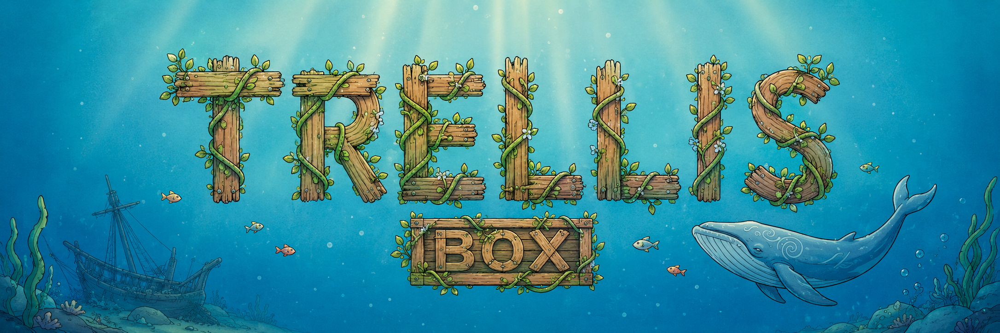

<p align="center">

</p>

<p align="center">
<a href="https://github.com/microsoft/TRELLIS"></a>
<a href="https://hub.docker.com/r/cassidybridges/trellis-box"></a>
<a href="https://pytorch.org"></a>
<a href="#requirements"></a>
<a href="https://github.com/off-by-some/TRELLIS-BOX/blob/main/LICENSE"></a>
</p>

This repository packages Microsoft's [TRELLIS](https://github.com/microsoft/TRELLIS) image-to-3D pipeline into containers you can actually run on consumer hardware without spending an afternoon fighting dependencies. The goal is simple: **run it locally, ungated, on a single consumer GPU** — with the defaults chosen so nothing forces you through a license wall or a datacenter card just to get a 3D model out.

It ships two apps side by side and a single launcher that runs either one:

- **`TRELLIS/`** — the original Streamlit app, tuned for lower VRAM with FP16 mixed precision (~50% memory savings) and automatic GLB export. Runs at http://localhost:8501.
- **`TRELLIS.2/`** — the newer O-Voxel/PBR pipeline with a Gradio interface and a dedicated texturing app. Runs at http://localhost:7860.

Pick version 1 when you want the leaner, lower-VRAM workflow. Pick version 2 when you want the newer PBR pipeline and material output. Both expect Docker, an NVIDIA GPU, and the `nvidia-container-toolkit`.


## Quickstart

```bash
$ git clone https://github.com/off-by-some/TRELLIS-BOX && cd TRELLIS-BOX

$ ./trellis build --version 1 # build once, when needed
$ ./trellis --version 1       # original Streamlit app  → http://localhost:8501

$ ./trellis build --version 2 # build once, when needed
$ ./trellis --version 2       # newer TRELLIS.2 app     → http://localhost:7860
```

That's the whole happy path on the default, ungated configuration. Two things to know before the first run:

- **TRELLIS.2 needs a quick one-time setup** — accept a free model license (RMBG-2.0) and authenticate with a Hugging Face token. Takes a minute; see [Model Access](#model-access-read-before-first-run) just below. (Version 1 needs neither.)
- **The first build is slow** because CUDA extensions compile from source. After that, `./trellis --version ...` starts the app without rebuilding; use `./trellis build -v 2` only when Dockerfiles or dependencies change. Model weights download to `~/.cache/huggingface` at runtime and are shared across runs, so you pay that cost once.

`./trellis` auto-detects the setup that usually just works: your GPU architecture, a sane number of compile jobs, and fallback ports if the defaults are taken. If you'd rather drive Docker yourself, the raw Compose equivalents are there:

```bash
$ docker compose up --build v1
$ docker compose up --build v2
```


## Requirements

- **Docker** with the NVIDIA Container Toolkit
- **NVIDIA GPU** with at least 8GB VRAM (16GB+ recommended, especially for v2)
- **Platform**: Linux, macOS, or Windows with Docker Desktop
- **Storage**: ~20GB free for models and Docker layers

### Install the NVIDIA Container Toolkit (Linux)

Arch / Manjaro:
```bash
$ sudo pacman -Syu nvidia-container-toolkit
```

Ubuntu / Debian:
```bash
# Add NVIDIA's signed repository
$ distribution=$(. /etc/os-release; echo $ID$VERSION_ID)
$ curl -fsSL https://nvidia.github.io/libnvidia-container/gpgkey | \
   sudo gpg --dearmor -o /usr/share/keyrings/nvidia-container-toolkit-keyring.gpg

$ curl -s -L https://nvidia.github.io/libnvidia-container/$distribution/libnvidia-container.list | \
   sed 's#deb https://#deb [signed-by=/usr/share/keyrings/nvidia-container-toolkit-keyring.gpg] https://#g' | \
   sudo tee /etc/apt/sources.list.d/nvidia-container-toolkit.list

$ sudo apt-get update && sudo apt-get install -y nvidia-container-toolkit
```

### Verify GPU access

```bash
$ ./trellis check
```

Or test Docker's GPU passthrough directly:
```bash
$ docker run --rm --gpus all nvidia/cuda:12.3.2-cudnn9-runtime-ubuntu22.04 nvidia-smi
```


## Model Access (read before first run)

By design, the default configuration avoids gated weights wherever possible — but TRELLIS.2 still has one. Running v2 takes two quick steps: accept a free license, and authenticate so the download can go through. Both are one-time.

> Version 1 has no gated dependencies. If you only run `--version 1`, you can skip this whole section.

### Step 1 — accept the RMBG-2.0 license

TRELLIS.2 uses `briaai/RMBG-2.0` for background removal. It's free, but Hugging Face gates the download, so accept access once before your first v2 run:

- Open https://huggingface.co/briaai/RMBG-2.0 and accept / request access with your Hugging Face account.

BRIA publishes RMBG-2.0 under its own license terms — including non-commercial self-hosted weights unless you have a commercial agreement — so it's worth a quick read of the model card.

### Step 2 — authenticate with a Hugging Face token

Accepting the license only matters if the container can prove it's you, so a token is required for v2 (it's what carries that acceptance through at download time). The default DINOv3 image encoder itself is public and needs no token — this is purely to get RMBG-2.0 through the gate. The same token also pulls any other private/gated models and raises your Hub rate limits.

The simplest path:

```bash
$ huggingface-cli login
```

After that, `./trellis` automatically reads `~/.cache/huggingface/token` and passes it into Docker. Prefer an explicit env var instead? Copy the example file and set it:

```bash
$ cp .env.example .env
$ $EDITOR .env
```

```bash
HF_TOKEN=hf_your_token_here
```

Either way, `./trellis config` prints `HF token detected` once it finds one.


## CLI Reference

Everything runs through the root-level [`trellis`](./trellis) launcher:

```text
🚀 TRELLIS Docker Manager

Usage: ./trellis [command] --version <1|2>

Run:
  --version 1     Start the original TRELLIS (Streamlit, port 8501)
  --version 2     Start TRELLIS.2 (Gradio, port 7860)
  -v 2            Short form for --version 2
  texture         Start the TRELLIS.2 texturing app (port 7861)

Develop:
  dev -v 1        Run version 1 with source mounted for hot reloading
  dev -v 2        Run version 2 with source mounted for hot reloading
  build -v 2      Build the selected image without starting it
  logs -v 2       Follow logs for the selected app

Manage:
  ps              Show running containers
  stop            Stop running containers
  config          Print the auto-detected configuration
  check           Verify Docker can see your GPU

Examples:
  ./trellis --version 1       # start the original app
  ./trellis -v 2              # start TRELLIS.2
  ./trellis dev -v 2          # develop against TRELLIS.2 with hot reloading
  ./trellis build -v 2        # pre-build version 2 without launching
  ./trellis check             # confirm GPU passthrough works
```

**Development mode (`dev`)** mounts your source into the container so UI and app changes reload without a rebuild. It's the right way to iterate on the interfaces or debug either app. Core algorithm or CUDA changes still need a fresh image.


## Use Cases

### Single Image to 3D Model
Drop in one image and get a textured 3D model back. Backgrounds are removed automatically, and the output is a GLB ready for 3D printing, a game engine, or whatever's next in your pipeline. Good for product shots, character concepts, and quick architectural ideas.

### Multi-View Enhancement
Feed 2–4 images from different angles when a single viewpoint isn't enough. The pipeline conditions on all of them during sampling, which cuts down artifacts on complex objects — mechanical parts, intricate sculptures, anything with detail that hides from one camera.

### PBR Materials (TRELLIS.2)
The v2 pipeline produces physically-based materials, and its dedicated texturing app (`./trellis texture`, port 7861) lets you push texture quality further. Reach for this when you care about how the asset looks under real lighting, not just its silhouette.

### Batch and Research Workflows
Both apps export GLB automatically, which makes them easy to wire into content pipelines or research loops. The FP16 path on v1 keeps things reachable on modest hardware, so you can iterate without an A100 on your desk.


## Configuration

The defaults are meant to work without any setup. You only need a `.env` file when you want to pin overrides — copy the example and edit what you need:

```bash
$ cp .env.example .env
```

The overrides worth knowing about day to day:

```bash
TRELLIS_V1_PORT=8501            # original app port
TRELLIS_V2_PORT=7860            # TRELLIS.2 app port
TORCH_CUDA_ARCH_LIST=8.9        # GPU compute capability (usually auto-detected)
MAX_JOBS=8                      # parallel compile jobs during build
HOST_UID=1000                   # host user id for writable bind mounts
HOST_GID=1000                   # host group id for writable bind mounts
HF_TOKEN=                       # Hugging Face token for private/gated downloads
TRELLIS2_FLOW_BLOCK_OFFLOAD=1   # offload v2 flow blocks to save VRAM
```

For encoder, attention-backend, and gated-checkpoint overrides, see [Advanced Configuration](#advanced-configuration) near the end — you shouldn't need any of it to get running.

The launcher normally reads `TORCH_CUDA_ARCH_LIST` from `nvidia-smi` on its own. Set it by hand only if detection fails or you're building for a different card than the one you're on:

| GPU | Value |
| --- | --- |
| RTX 3090 / A5000 | `8.6` |
| RTX 4090 | `8.9` |
| A100 | `8.0` |
| H100 | `9.0` |


## Outputs and Caches

Each app keeps its generated files in its own directory:

- `TRELLIS/outputs/`
- `TRELLIS.2/outputs/`
- `TRELLIS.2/tmp/`

Model caches live on the host and are shared across both apps and every run, so nothing gets re-downloaded needlessly:

- `~/.cache/huggingface`
- `~/.cache/rembg`
- `~/.cache/trellis/triton`

The launcher creates these directories for you and builds containers with your host UID/GID so mounted caches and outputs stay writable.


## Troubleshooting

**GPU isn't visible.** Start here:
```bash
$ ./trellis check
```
If that fails, Docker can't see your GPU — recheck the NVIDIA Container Toolkit install above before touching anything else.

**v2 background removal fails with a 403.** You haven't accepted the RMBG-2.0 license, or the token in use hasn't. Revisit [Model Access](#model-access-read-before-first-run), accept access at https://huggingface.co/briaai/RMBG-2.0, and confirm `./trellis config` reports `HF token detected`.

**v2 build fails while compiling CUDA extensions.** This is almost always too many parallel jobs eating memory. Lower it:
```bash
$ MAX_JOBS=2 ./trellis build -v 2
```

**v2 runs out of VRAM.** Keep flow-block offloading on — it's the default for a reason:
```bash
TRELLIS2_FLOW_BLOCK_OFFLOAD=1
```
Set it to `0` only when you have VRAM to spare and want the faster inference that comes without offloading.

**v2 cannot write the Triton cache.** Rebuild the image so it has the cache-fixing entrypoint:
```bash
$ ./trellis build -v 2
```
For direct `docker run` usage, rebuild with the `APP_UID` and `APP_GID` build args shown in [TRELLIS.2/README.md](./TRELLIS.2/README.md).

**General build weirdness.** A clean rebuild clears most of it:
```bash
$ ./trellis stop && docker system prune -f && ./trellis build -v 2
```


## How to Contribute

1. Fork and clone the repo.
2. Make sure Docker and the NVIDIA Container Toolkit are working (`./trellis check`).
3. Develop against the app you're changing with source mounted:
   ```bash
   $ ./trellis dev -v 1     # or: ./trellis dev -v 2
   ```
4. Test the interface at its port (8501 for v1, 7860 for v2) and watch the logs:
   ```bash
   $ ./trellis logs -v 2
   ```
5. Open a pull request from a feature branch with a clear description and the GPU you tested on.

Bugs and feature requests go in the [issue tracker](https://github.com/off-by-some/TRELLIS-BOX/issues). For anything GPU- or performance-related, include your GPU model, Docker version, and `nvidia-smi` output — it saves a round trip.


## Architecture

Both apps share the same core stages, with v2 adding PBR material output:

1. **Image preprocessing** — background removal, cropping, resizing
2. **Sparse structure generation** — flow-based latent generation
3. **Structured latent generation** — feature refinement
4. **Decoding** — mesh, Gaussian, and radiance-field representations (v2 adds O-Voxel/PBR)
5. **GLB export** — automatic texture baking and export

The memory savings on v1 come from converting transformer models to FP16 while keeping normalization layers in FP32, plus aggressive CUDA cache clearing between stages. On v2, the same pressure is handled by offloading flow blocks (`TRELLIS2_FLOW_BLOCK_OFFLOAD`) so large models fit on smaller cards.


## Advanced Configuration

Everything here is optional. The defaults are chosen to run locally and ungated on consumer hardware; reach for these only if you're deliberately trading that away — matching Microsoft's original checkpoints exactly, or squeezing out more speed.

### Image encoder (DINOv3)

By default TRELLIS.2 uses the public timm conversion of DINOv3 ViT-L/16, which avoids Meta's gated checkpoint while staying in the same ViT-L/16 DINOv3/LVD-1689M family the released pipeline expects:

```bash
TRELLIS2_IMAGE_ENCODER=timm-dinov3
TRELLIS2_DINOV3_MODEL=hf_hub:timm/vit_large_patch16_dinov3_qkvb.lvd1689m
```

It downloads at runtime into `~/.cache/huggingface` — not into image layers — so normal image pushes don't carry the weights. The timm checkpoint identifies itself as DINOv3 and uses the DINOv3 license; review it before use:

- https://huggingface.co/timm/vit_large_patch16_dinov3_qkvb.lvd1689m
- https://huggingface.co/timm/vit_large_patch16_dinov3_qkvb.lvd1689m/blob/main/LICENSE.md

You can also point `TRELLIS2_IMAGE_ENCODER` at any timm/HF Hub model id directly.

**Using Meta's original gated checkpoint.** If you specifically want the checkpoint Microsoft shipped with TRELLIS.2:

```bash
TRELLIS2_IMAGE_ENCODER=meta-dinov3
```

Then open https://huggingface.co/facebook/dinov3-vitl16-pretrain-lvd1689m, accept the license / request access, and confirm `./trellis config` reports `HF token detected`. This reintroduces a gate the default path is built to avoid — only worth it if you need exact parity with the upstream release.

### Attention backends

TRELLIS.2 uses SageAttention for dense attention on supported GPUs and FlashAttention for packed variable-length sparse attention by default:

```bash
ATTN_BACKEND=sage               # dense attention backend
SPARSE_ATTN_BACKEND=flash_attn  # packed varlen sparse attention backend
SAGEATTENTION_PACKAGE=sageattention==1.0.6
```

The launcher auto-selects `sage` for dense attention on Ampere, Ada, and Hopper GPUs with the current CUDA 12.4 image, and the Docker build installs SageAttention whenever either backend is set to `sage`. `SPARSE_ATTN_BACKEND=sage` is also implemented (via `sageattn_varlen`), but the default stays on FlashAttention while that path gets broader real-world testing. `SAGEATTENTION_PACKAGE` defaults to the current PyPI release (`sageattention==1.0.6`); override it with a Git/source spec to experiment with a newer upstream build.


## Background

This started because running TRELLIS locally was genuinely painful. The research is excellent, but the setup involved a long chain of platform-specific dependencies that broke in creative ways. Containerizing it fixes the reproducibility problem — the environment is the same everywhere — and the FP16 work on v1 brought the VRAM requirements down far enough that you don't need datacenter hardware to try it.

Adding TRELLIS.2 alongside the original kept that spirit: one launcher, two pipelines, no manual environment surgery, and defaults that stay ungated wherever the licenses allow. You choose the tradeoff (leaner v1 vs. newer PBR v2) and the tooling handles the rest.


## Acknowledgements

I hit a wall running TRELLIS myself until I found [UNES97's trellis-3d-docker project](https://github.com/UNES97/trellis-3d-docker), which gave me the initial Dockerized foundation. Thanks to [@UNES97](https://github.com/UNES97) for doing that groundwork and making TRELLIS reachable for the rest of us.

This project builds on Microsoft's [TRELLIS](https://github.com/microsoft/TRELLIS) research and its structured 3D latent representations. Full credit to the original researchers for the work everything here depends on — along with the open-source ecosystem underneath it: PyTorch, NVIDIA's CUDA stack, and the wider ML tooling landscape.


## License

MIT License, for this containerization and tooling. Based on Microsoft's TRELLIS research.

Note that the models it runs carry their own terms. In the default configuration, TRELLIS.2's DINOv3 image encoder uses the public timm ViT-L/16 conversion (`hf_hub:timm/vit_large_patch16_dinov3_qkvb.lvd1689m`) under the DINOv3 license, and background removal uses `briaai/RMBG-2.0` under BRIA's license (non-commercial self-hosted unless you hold a commercial agreement). Both download at runtime into the mounted Hugging Face cache rather than during Docker build. Review each model's license before use, especially for commercial work.