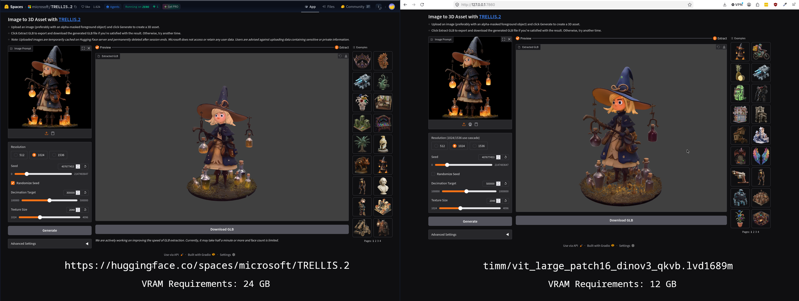

<p align="center">

</p>

<p align="center">
<a href="https://github.com/microsoft/TRELLIS"></a>
<a href="https://hub.docker.com/r/cassidybridges/trellis-box"></a>
<a href="https://pytorch.org"></a>
<a href="#requirements"></a>
<a href="https://github.com/off-by-some/TRELLIS-BOX/blob/main/LICENSE"></a>
</p>

This repository packages Microsoft's [TRELLIS](https://github.com/microsoft/TRELLIS) image-to-3D pipeline into containers you can actually run on consumer hardware without spending an afternoon fighting dependencies. The goal is simple: **run it locally, ungated, on a single consumer GPU** — with the defaults chosen so nothing forces you through a license wall or a datacenter card just to get a 3D model out.

It ships two apps side by side and a single launcher that runs either one:

- **`TRELLIS/`** — the original Streamlit app, tuned for lower VRAM with FP16 mixed precision (~50% memory savings) and automatic GLB export. Runs at http://localhost:8501.
- **`TRELLIS.2/`** — the newer O-Voxel/PBR pipeline with a Gradio interface and a dedicated texturing app. Runs at http://localhost:7860.

**Both builds are tuned for high-quality generation on a 12 GB GPU.** Microsoft's TRELLIS.2 repository specifies a 24 GB minimum, tested on A100/H100 hardware; the memory work here targets a 12 GB local runtime through FP16 on v1, plus lazy model scheduling and flow-block offload on v2. Docker, an NVIDIA GPU, and the NVIDIA Container Toolkit are the only requirements.


## Quickstart

```bash
git clone https://github.com/off-by-some/TRELLIS-BOX
cd TRELLIS-BOX

# Build once, when needed.
./trellis build --version 1
./trellis build --version 2

# Run either app.
./trellis --version 1    # original Streamlit app: http://localhost:8501
./trellis --version 2    # newer TRELLIS.2 app:    http://localhost:7860
```

That's the whole happy path — no login, no license wall. Two things to know before the first run:

- **The defaults are fully ungated.** v2 uses the public timm DINOv3 conversion and public BiRefNet background removal, so no Hugging Face token is required. You only need one if you opt into a gated model or hit Hub rate limits — see [Model Access](#model-access).
- **The first build is slow** because CUDA extensions compile from source. After that, `./trellis --version ...` starts the app without rebuilding; use `./trellis build -v 2` only when Dockerfiles or dependencies change. Model weights download to `~/.cache/huggingface` at runtime and are shared across runs, so you pay that cost once.

`./trellis` auto-detects the setup that usually just works: your GPU architecture, a sane number of compile jobs, and fallback ports if the defaults are taken. If you'd rather drive Docker yourself, the raw Compose equivalents are there:

```bash
docker compose up --build v1
docker compose up --build v2
```


## Requirements

- **Docker** with the NVIDIA Container Toolkit
- **NVIDIA GPU** with 12 GB VRAM
- **Platform**: Linux, macOS, or Windows with Docker Desktop
- **Storage**: ~20GB free for models and Docker layers

### Install the NVIDIA Container Toolkit (Linux)

Arch / Manjaro:

```bash
sudo pacman -Syu nvidia-container-toolkit
```

Ubuntu / Debian:

```bash
# Add NVIDIA's signed repository
distribution=$(. /etc/os-release; echo "$ID$VERSION_ID")

curl -fsSL https://nvidia.github.io/libnvidia-container/gpgkey \
  | sudo gpg --dearmor \
    -o /usr/share/keyrings/nvidia-container-toolkit-keyring.gpg

curl -s -L "https://nvidia.github.io/libnvidia-container/${distribution}/libnvidia-container.list" \
  | sed 's#deb https://#deb [signed-by=/usr/share/keyrings/nvidia-container-toolkit-keyring.gpg] https://#g' \
  | sudo tee /etc/apt/sources.list.d/nvidia-container-toolkit.list

sudo apt-get update
sudo apt-get install -y nvidia-container-toolkit
```

### Verify GPU access

```bash
./trellis check
```

Or test Docker's GPU passthrough directly:

```bash
docker run --rm --gpus all \
  nvidia/cuda:12.3.2-cudnn9-runtime-ubuntu22.04 \
  nvidia-smi
```


## CLI Reference

Everything runs through the root-level [`trellis`](./trellis) launcher:

```text
🚀 TRELLIS Docker Manager

Usage: ./trellis [command] --version <1|2>

Run:
  --version 1     Start the original TRELLIS (Streamlit, port 8501)
  --version 2     Start TRELLIS.2 (Gradio, port 7860)
  -v 2            Short form for --version 2
  texture         Start the TRELLIS.2 texturing app (port 7861)

Develop:
  dev -v 1        Run version 1 with source mounted for hot reloading
  dev -v 2        Run version 2 with source mounted for hot reloading
  build -v 2      Build the selected image without starting it
  logs -v 2       Follow logs for the selected app

Manage:
  ps              Show running containers
  stop            Stop running containers
  config          Print the auto-detected configuration
  check           Verify Docker can see your GPU

Examples:
  ./trellis --version 1       # start the original app
  ./trellis -v 2              # start TRELLIS.2
  ./trellis dev -v 2          # develop against TRELLIS.2 with hot reloading
  ./trellis build -v 2        # pre-build version 2 without launching
  ./trellis check             # confirm GPU passthrough works
```

**Development mode (`dev`)** mounts your source into the container so UI and app changes reload without a rebuild. It's the right way to iterate on the interfaces or debug either app. Core algorithm or CUDA changes still need a fresh image.


## Use Cases

### Single Image to 3D Model
Drop in one image and get a textured 3D model back. Backgrounds are removed automatically, and the output is a GLB ready for 3D printing, a game engine, or whatever's next in your pipeline. Good for product shots, character concepts, and quick architectural ideas.

### Multi-View Enhancement
Feed 2–4 images from different angles when a single viewpoint isn't enough. The pipeline conditions on all of them during sampling, which cuts down artifacts on complex objects — mechanical parts, intricate sculptures, anything with detail that hides from one camera.

### PBR Materials (TRELLIS.2)
The v2 pipeline produces physically-based materials, and its dedicated texturing app (`./trellis texture`, port 7861) lets you push texture quality further. Reach for this when you care about how the asset looks under real lighting, not just its silhouette.

### Batch and Research Workflows
Both apps export GLB automatically, which makes them easy to wire into content pipelines or research loops. The FP16 path on v1 keeps things reachable on modest hardware, so you can iterate without an A100 on your desk.


## Configuration

The defaults are meant to work without any setup. You only need a `.env` file when you want to pin overrides — copy the example and edit what you need:

```bash
cp .env.example .env
```

The overrides worth knowing about day to day:

```dotenv
TRELLIS_V1_PORT=8501            # original app port
TRELLIS_V2_PORT=7860            # TRELLIS.2 app port
TORCH_CUDA_ARCH_LIST=8.9        # GPU compute capability (usually auto-detected)
MAX_JOBS=8                      # parallel compile jobs during build
HOST_UID=1000                   # host user id for writable bind mounts
HOST_GID=1000                   # host group id for writable bind mounts
HF_TOKEN=                       # Hugging Face token for private/gated downloads
TRELLIS2_FLOW_BLOCK_OFFLOAD=1   # offload v2 flow blocks to save VRAM
```

For encoder, background-removal, and attention-backend overrides, see [Advanced Configuration](#advanced-configuration) — you shouldn't need any of it to get running.

The launcher normally reads `TORCH_CUDA_ARCH_LIST` from `nvidia-smi` on its own, then falls back to the GPU model listed under `/proc/driver/nvidia/gpus/` on Linux hosts. Set it by hand only if detection fails or you're building for a different card than the one you're on:

| GPU | Value |
| --- | --- |
| RTX 3090 / A5000 | `8.6` |
| RTX 4090 | `8.9` |
| A100 | `8.0` |
| H100 | `9.0` |

This auto-detection only runs through `./trellis`. A bare `docker build` can't reliably see the host GPU, so pass `--build-arg TORCH_CUDA_ARCH_LIST=...` there if you want a narrow CUDA build.


## Architecture

Both apps share the same core stages, with v2 adding PBR material output:

1. **Image preprocessing** — background removal, cropping, resizing
2. **Sparse structure generation** — flow-based latent generation
3. **Structured latent generation** — feature refinement
4. **Decoding** — mesh, Gaussian, and radiance-field representations (v2 adds O-Voxel/PBR)
5. **GLB export** — automatic texture baking and export

The memory savings on v1 come from converting transformer models to FP16 while keeping normalization layers in FP32, plus aggressive CUDA cache clearing between stages. On v2, the same pressure is handled by offloading flow blocks (`TRELLIS2_FLOW_BLOCK_OFFLOAD`) so large models fit on smaller cards.


## Optimizations

The point of these changes is to keep TRELLIS.2's output path high quality while making the local runtime realistic on a 12 GB card. Everything here preserves the UI and is designed not to reduce generation quality.

**Memory and scheduling**

- **Low-VRAM model scheduling** — v2 lazily loads model weights, moves only the active stage to CUDA, and unloads models afterward. This keeps the 512/1024 cascade usable without pinning every decoder and flow model in VRAM at once.
- **Flow block offload** — large flow models can offload transformer blocks during inference with `TRELLIS2_FLOW_BLOCK_OFFLOAD=1`, trading some speed for a much lower peak memory footprint.
- **No duplicate export decode** — generation already decodes a mesh for preview, so the app caches that decoded mesh in the session tmp directory and reuses it for GLB export, falling back to latent decode only if the cache is missing.
- **Export headroom cleanup** — before GLB export, v2 unloads generation models, moves image preprocessing models and HDRI preview maps off CUDA, and then reloads only the cached mesh needed for O-Voxel export.
- **Inference-only execution** — key v2 inference paths use `torch.inference_mode()` and disable sampler intermediate storage, cutting PyTorch bookkeeping without changing the math.
- **Memory-conscious preview/rendering** — preview rendering keeps the same UI and output but explicitly cleans CUDA state and render backends between frames to avoid late-stage OOMs.

**Ungated by default**

- **Pinned, public preprocessing** — DINOv3 uses the public timm ViT-L/16 conversion, and background removal uses the public full BiRefNet pinned to a known commit. Downloads happen at runtime into the host cache, not Docker layers.

**Experimental acceleration**

- **SageAttention support** — dense attention can use `ATTN_BACKEND=sage`, and packed variable-length sparse attention can use `SPARSE_ATTN_BACKEND=sage`. FlashAttention remains the default while quality and speed are benchmarked across more GPUs.

**Developer and container ergonomics**

- **Runtime cache mounts** — Hugging Face, rembg, and Triton caches live on the host, so models and Triton kernels are reused across container starts.
- **CUDA build caching** — Dockerfiles are layered so expensive CUDA extensions build before fast-changing app code and optional attention experiments, reducing rebuild churn.
- **Host-aware launcher** — `./trellis` detects GPU architecture, build parallelism, UID/GID, ports, and HF tokens so the default run path stays short and repeatable.


## Model Access

**You don't need a Hugging Face account to run either app.** That's a deliberate substitution: stock TRELLIS.2 pulls Meta's gated DINOv3 checkpoint and, in many setups, a gated background remover. TRELLIS-BOX swaps both for public equivalents by default — the timm DINOv3 conversion for the image encoder and BiRefNet for background removal — so a fresh clone runs with no login and no license wall. As long as the public downloads aren't rate-limited, v2 runs with no account at all.

Authenticate only if you want higher Hub rate limits, private models, or one of the optional gated backends:

```bash
huggingface-cli login
```

After that, `./trellis` automatically reads `~/.cache/huggingface/token` and passes it into Docker. Prefer an explicit env var instead?

```bash
cp .env.example .env
${EDITOR:-nano} .env
```

```dotenv
HF_TOKEN=hf_your_token_here
```

`./trellis config` prints `HF token detected` once it finds one.

The optional gated backends, if you choose to opt in:

- `TRELLIS2_IMAGE_ENCODER=meta-dinov3` — accept access at https://huggingface.co/facebook/dinov3-vitl16-pretrain-lvd1689m
- `TRELLIS2_REMBG_BACKEND=bria` — accept access at https://huggingface.co/briaai/RMBG-2.0 and review BRIA's license terms

Both are detailed just below under [Advanced Configuration](#advanced-configuration); you never need either to get running.


## Advanced Configuration

Everything here is optional — a fresh clone targets a 12 GB card without touching any of it. These overrides aren't about buying back performance; they're about *access* and exactness. Reach for them when you want a specific model rather than the public stand-in: matching Microsoft's original DINOv3 checkpoint bit-for-bit, choosing a different background remover, or opting into an experimental attention backend. Each override is a single environment variable, and each of the models below downloads at runtime into `~/.cache/huggingface` rather than being baked into image layers.

If you just want to run TRELLIS-BOX, you can skip this section entirely and everything works.

### Image encoder (DINOv3)

By default, TRELLIS-BOX's TRELLIS.2 uses the public timm conversion of DINOv3 ViT-L/16, **which avoids Meta's gated checkpoint** while staying in the same ViT-L/16 DINOv3/LVD-1689M family the official pipeline expects:

```dotenv
TRELLIS2_IMAGE_ENCODER=timm-dinov3
TRELLIS2_DINOV3_MODEL=hf_hub:timm/vit_large_patch16_dinov3_qkvb.lvd1689m
```

This TIMM conversion might create tiny output differences because the generation pipeline amplifies floating-point changes. It should not normally transform a sound object into maritime abstract sculptures, however.

<p align="center">
  
</p>

The checkpoint downloads at runtime into `~/.cache/huggingface`, so normal image pushes don't carry the weights. The timm checkpoint identifies itself as DINOv3 and uses the DINOv3 license; please review it before use:

- https://huggingface.co/timm/vit_large_patch16_dinov3_qkvb.lvd1689m
- https://huggingface.co/timm/vit_large_patch16_dinov3_qkvb.lvd1689m/blob/main/LICENSE.md

You can also point `TRELLIS2_IMAGE_ENCODER` at any timm/HF Hub model id directly. If you specifically want the checkpoint Microsoft shipped with TRELLIS.2:

```dotenv
TRELLIS2_IMAGE_ENCODER=meta-dinov3
```

Then open https://huggingface.co/facebook/dinov3-vitl16-pretrain-lvd1689m, accept the license / request access, and confirm `./trellis config` reports `HF token detected`. This reintroduces a gate the default path is built to avoid — only worth it if you need exact parity with the upstream release.

### Background removal

When an uploaded image already has a non-opaque alpha channel, TRELLIS.2 uses that existing alpha. Otherwise the default remover is the public full BiRefNet model, pinned to commit `e2bf8e4460fc8fa32bba5ea4d94b3233d367b0e4`:

```dotenv
TRELLIS2_REMBG_BACKEND=auto
```

Presets:

| Value | Behavior |
| --- | --- |
| `auto` | Use existing alpha; otherwise `ZhengPeng7/BiRefNet` |
| `birefnet` | Always use `ZhengPeng7/BiRefNet` when alpha is missing |
| `lite` | Use `ZhengPeng7/BiRefNet_lite` for faster/lighter masking |
| `bria` | Use the optional gated `briaai/RMBG-2.0` |
| `none` | Require an alpha-masked RGBA image |

You can point directly at another compatible model:

```dotenv
TRELLIS2_REMBG_MODEL=ZhengPeng7/BiRefNet
TRELLIS2_REMBG_REVISION=e2bf8e4460fc8fa32bba5ea4d94b3233d367b0e4
TRELLIS2_REMBG_DEVICE=auto
TRELLIS2_REMBG_DTYPE=float16
```

Because these background-removal models load with `trust_remote_code=True`, the full BiRefNet default is pinned for reproducible runs. If you swap to another compatible model, pin `TRELLIS2_REMBG_REVISION` for shared deployments. Defaults download at runtime into `~/.cache/huggingface`, not during Docker build.

### Attention backends

TRELLIS.2 uses FlashAttention for both dense and packed variable-length sparse attention by default, which keeps the local path closest to the upstream release while quality is being validated:

```dotenv
ATTN_BACKEND=flash_attn         # dense attention backend
SPARSE_ATTN_BACKEND=flash_attn  # packed varlen sparse attention backend
```

SageAttention is available as an opt-in speed experiment:

```dotenv
ATTN_BACKEND=sage
SAGEATTENTION_PACKAGE=sageattention==1.0.6
```

The Docker build installs SageAttention whenever either backend is set to `sage`. `SPARSE_ATTN_BACKEND=sage` is also implemented via `sageattn_varlen`, but the default stays on FlashAttention while that path gets broader real-world testing.

### Outputs and caches

Each app keeps its generated files in its own directory:

- `TRELLIS/outputs/`
- `TRELLIS.2/outputs/`
- `TRELLIS.2/tmp/`

Model caches live on the host and are shared across both apps and every run, so nothing gets re-downloaded needlessly:

- `~/.cache/huggingface`
- `~/.cache/rembg`
- `~/.cache/trellis/triton`

The launcher creates these directories for you and builds containers with your host UID/GID so mounted caches and outputs stay writable.


## Background

This started because I wanted to actually *use* TRELLIS — run it, poke at it, and improve it for my own projects — and I was doing that on a single 3080 Ti, not the god-tier server hardware these pipelines quietly assume. TRELLIS.2's own repository asks for 24 GB of VRAM and was tested on A100s and H100s; my card had 12 GB. That gap is the whole reason this project exists. Running TRELLIS locally was painful to begin with — the research is excellent, but the setup involved a long chain of platform-specific dependencies that broke in creative ways, and even once it ran, the stock memory footprint left no room for a consumer card.

Containerizing it fixes the reproducibility problem — the environment is the same everywhere — and the FP16 work on v1, plus the memory scheduling and offload work on v2, brought the requirement down far enough to fit in 12 GB. The optimizations weren't an afterthought; they're what made it runnable on the hardware I had.

Adding TRELLIS.2 alongside the original kept that spirit: one launcher, two pipelines, no manual environment surgery, and defaults that stay ungated wherever the licenses allow. You choose which fits your work (leaner v1 vs. newer PBR v2) and the tooling handles the rest.


## Troubleshooting

**GPU isn't visible.** Start here:

```bash
./trellis check
```

If that fails, Docker can't see your GPU — recheck the [NVIDIA Container Toolkit install](#install-the-nvidia-container-toolkit-linux) before touching anything else.

**v2 background removal fails with a 403.** The ungated default shouldn't hit this — it only happens if you opted into Bria or another gated model. Accept access for that model, authenticate with `huggingface-cli login` or `HF_TOKEN=...`, and confirm `./trellis config` reports `HF token detected`.

**v2 build fails while compiling CUDA extensions.** This is almost always too many parallel jobs eating memory. Lower it:

```bash
MAX_JOBS=2 ./trellis build -v 2
```

**v2 runs out of VRAM.** Keep flow-block offloading on — it's the default for a reason:

```dotenv
TRELLIS2_FLOW_BLOCK_OFFLOAD=1
```

Set it to `0` only when you have VRAM to spare and want the faster inference that comes without offloading.

**v2 cannot write the Triton cache.** Rebuild the image so it has the cache-fixing entrypoint:

```bash
./trellis build -v 2
```

For direct `docker run` usage, rebuild with the `APP_UID` and `APP_GID` build args shown in [TRELLIS.2/README.md](./TRELLIS.2/README.md).

**General build weirdness.** A clean rebuild clears most of it:

```bash
./trellis stop
docker system prune -f
./trellis build -v 2
```


## How to Contribute

1. Fork and clone the repo.
2. Make sure Docker and the NVIDIA Container Toolkit are working (`./trellis check`).
3. Develop against the app you're changing with source mounted:
   ```bash
   ./trellis dev -v 1
   ./trellis dev -v 2
   ```
4. Test the interface at its port (8501 for v1, 7860 for v2) and watch the logs:
   ```bash
   ./trellis logs -v 2
   ```
5. Open a pull request from a feature branch with a clear description and the GPU you tested on.

Bugs and feature requests go in the [issue tracker](https://github.com/off-by-some/TRELLIS-BOX/issues). For anything GPU- or performance-related, include your GPU model, Docker version, and `nvidia-smi` output — it saves a round trip.


## Acknowledgements

I hit a wall running TRELLIS myself until I found [UNES97's trellis-3d-docker project](https://github.com/UNES97/trellis-3d-docker), which gave me the initial Dockerized foundation. Thanks to [@UNES97](https://github.com/UNES97) for doing that groundwork and making TRELLIS reachable for the rest of us.

This project builds on Microsoft's [TRELLIS](https://github.com/microsoft/TRELLIS) research and its structured 3D latent representations. Full credit to the original researchers for the work everything here depends on — along with the open-source ecosystem underneath it: PyTorch, NVIDIA's CUDA stack, and the wider ML tooling landscape.


## License

MIT License, for this containerization and tooling. Based on Microsoft's TRELLIS research.

Note that the models it runs carry their own terms. In the default configuration, TRELLIS.2's DINOv3 image encoder uses the public timm ViT-L/16 conversion (`hf_hub:timm/vit_large_patch16_dinov3_qkvb.lvd1689m`) under the DINOv3 license, and background removal uses `ZhengPeng7/BiRefNet`, which is MIT-tagged on Hugging Face. The optional `briaai/RMBG-2.0` backend uses BRIA's license and is gated. Model weights download at runtime into the mounted Hugging Face cache rather than during Docker build. Review each model's license before use, especially for commercial work.
